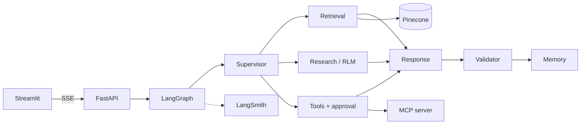

# Crestline Assistant

An internal AI assistant for **Crestline Commercial Bank** (a fictional bank). Employees can ask
about policies, architecture, runbooks, incidents, product specs and meeting notes. The assistant
searches the documents, calls enterprise tools, explains its reasoning with citations, and remembers
the conversation. Every step the agents take is visible live in the UI and traced in LangSmith.

**Stack:**
- **Agents:** LangGraph multi-agent graph with a Recursive Language Model research agent.
- **Models:** Google Gemini on the free tier: a chain of four Flash and two Flash-Lite models, and
  `gemini-embedding-001` for embeddings.
- **Search:** Pinecone hybrid search (dense + BM25) with namespaces, metadata filters and reranking.
- **Services:** FastAPI (async, SSE streaming), Streamlit UI, MCP server for enterprise data.
- **Tracing:** LangSmith.
- **Deployment:** Docker Compose.

- Architecture and design decisions: [docs/architecture.md](docs/architecture.md)



## Quick start

### 1. Configure

```bash
cp .env.example .env
```

Fill in the three keys. All three have free plans:

| Variable | Where to get it | Without it |
|---|---|---|
| `GOOGLE_API_KEY` | https://aistudio.google.com/apikey | Keyword planner, fixed research plan, extractive answers ("limited mode") |
| `PINECONE_API_KEY` | https://app.pinecone.io | Local BM25 over the same chunks |
| `LANGSMITH_API_KEY` | https://smith.langchain.com | Tracing off; the UI activity panel still works |

Also set `JWT_SECRET` to a random string of at least 32 characters.

Every path in the "Without it" column is the same code the app uses when a dependency fails in
production. That is why the whole test suite runs offline.

### 2. Load the knowledge base into Pinecone

```bash
uv sync
uv run python -m app.retrieval.ingest              # create the hybrid index and upsert 166 chunks
uv run python -m app.retrieval.ingest --recreate   # rebuild from scratch
```

- **Free-tier pacing.** Ingestion embeds 20 texts at a time. When the free-tier limit (100 texts per
  minute) is hit, it waits and continues.
- **Safe to re-run.** Record ids are stable, so running it again updates records in place.
- **Smoke query.** It ends with a query through the same search code the agents use. The last line
  should read `mode=hybrid reranked=True`.

### 3. Run

With Docker:

```bash
docker compose up --build
```

Or locally with uv, one command per terminal:

```bash
uv run python -m mcp_server.server          # MCP server, port 8001
uv run uvicorn app.main:app --port 8000     # API, port 8000
uv run streamlit run ui/app.py              # UI, port 8501
```

| URL | What |
|---|---|
| http://localhost:8501 | Chat UI |
| http://localhost:8000/docs | API docs |
| http://localhost:8000/health | Dependencies, usable Gemini models, circuit breakers, fault switches |
| http://localhost:8001/mcp | MCP server |

**Demo users:**

| User | Password | Role |
|---|---|---|
| `viewer1` | `viewer123` | Viewer: chat and search only |
| `analyst1` | `analyst123` | Analyst: adds deep research, analytics and MCP tools |
| `admin1` | `admin123` | Administrator: all tools, write actions with approval, fault switches, audit log |

## Running on the Gemini free tier

Free-tier quotas are small and apply per model: about 20 requests per day for a Flash model, a
per-minute limit, and 100 embedded texts per minute. The assistant is built to live within that:

| Measure | Effect |
|---|---|
| Chain of six models (`GEMINI_MODEL`, `GEMINI_FALLBACK_MODEL`, comma-separated) | Each model has its own quota, so the chain multiplies the daily allowance. |
| Quota tracker (reads real 429 responses) | A model that used its daily quota is skipped until midnight Pacific. A per-minute limit skips it for the delay Google sends. No time is wasted on calls that will fail. |
| Client-side rate limiter (`GEMINI_RPM`, default 10) | Keeps each model under its per-minute limit, even during parallel research calls. |
| Cheap calls go to Flash-Lite first | Research sub-queries, query rewrites and summaries save the Flash quota. |
| Small research budget | 6 turns, 12 sub-calls, 2 in parallel per research question. |
| Limited mode when every model is used up | Answers are built from the best passages, with citations, instead of failing. |

`/health` and the UI's **System health** panel show which models are usable and which are waiting
for their quota. A demo recorded soon after midnight Pacific time starts with every quota fresh.

## How the brief maps to the code

| Requirement | Where |
|---|---|
| Chat, streaming, agent activity panel | `ui/app.py`, SSE in `app/main.py` |
| Async FastAPI, structured logging, error handling | `app/main.py`, `app/observability.py`, node wrapper in `app/agents/graph.py` |
| Supervisor, retrieval, research, response agents | `app/agents/*.py` |
| Recursive Language Model | `app/agents/research_agent.py`, `app/sandbox.py` |
| Hybrid search, namespaces, metadata filters, attribution, reranking | `app/retrieval/search.py`, `app/retrieval/bm25.py`, `app/retrieval/documents.py` |
| Conversational and long-term memory | `app/memory.py`, `app/agents/memory_agent.py` |
| Knowledge search, MCP and Python analysis tools | `app/tools.py`, `mcp_server/server.py` |
| LLM choice and free-tier handling | `app/llm.py` |
| LangSmith tracing and feedback | run config in `app/main.py`, `@traceable` in search and research, `app/observability.py` |
| Prompt injection protection, validation, guardrails | `app/guardrails.py`, `app/agents/guard.py`, validator in `app/agents/response_agent.py` |
| Auth and RBAC (hardcoded users) | `app/auth.py` (`ROLE_POLICY`), enforced in `app/tools.py` and `app/retrieval/search.py` |
| Token bucket rate limiting | `app/auth.py` (`TokenBucket`) |
| Graceful degradation | `app/resilience.py` (circuit breakers, fault switches), node fallbacks in `app/agents/graph.py` |
| Human-in-the-loop approval | `approve_action` in `app/agents/tool_agent.py` |
| Feedback loop | thumbs up/down in UI → `/feedback` → LangSmith and store |
| Mock data | `data/docs/` (28 documents), `data/mcp/` (employees, services, incidents) |
| Docker Compose | `Dockerfile`, `docker-compose.yml` |

## Tests and evaluation

```bash
uv run pytest               # 54 tests, no keys or network needed (even if .env has keys)
uv run ruff check .
uv run python -m evals.run  # retrieval quality
```

The tests cover:
- **Guardrails:** injection, redaction, citations (including grouped and document-level), canary, brand rules.
- **Auth, rate limit and resilience:** login and tokens, the token bucket, the circuit breaker, and
  the Gemini quota tracker.
- **Retrieval:** BM25 and the access filters.
- **Sandbox:** escape attempts.
- **Tools:** RBAC at tool execution.
- **Full graph runs:** memory across turns, viewer limits, research batching, the approval pause and
  resume, and recovery when the supervisor crashes.
- **API:** 401, 403, 422, 429, SSE, and streaming filters that hold across token boundaries.

Retrieval eval (`evals/golden.yaml`, 15 questions phrased differently from the documents), measured
against the live Pinecone index:

| System | recall@5 | MRR |
|---|---|---|
| BM25 only | 1.00 | 0.85 |
| Hybrid (dense + BM25) | 0.93 | 0.83 |
| Hybrid + rerank | 1.00 | 0.97 |

The reranker is what puts the right document first. Hybrid on its own mostly helps with questions
that use different words from the documents.

## Project layout

```
app/
  main.py              API endpoints and SSE streaming
  config.py            settings from .env
  auth.py              users, roles, JWT, token bucket
  guardrails.py        input/output safety checks
  sandbox.py           restricted Python runner
  resilience.py        circuit breakers and fault switches
  llm.py               Gemini model chain, quota tracking, embeddings
  memory.py            session and long-term memory, audit, feedback
  tools.py             tool registry, MCP client, execute_tool()
  retrieval/           documents, bm25, search, ingest
  agents/              state, graph, guard, memory, supervisor, retrieval, research, tool, response agents
mcp_server/server.py   enterprise data MCP server
ui/app.py              Streamlit UI
data/                  mock documents and MCP datasets
evals/                 retrieval golden set and runner
tests/                 offline test suite
docs/                  architecture and demo script
```

## Configuration reference

| Variable | Default | Purpose |
|---|---|---|
| `GEMINI_MODEL` | `gemini-3.8-flash,gemini-3.7-flash,gemini-3.6-flash,gemini-3.5-flash` | Main models, tried in order |
| `GEMINI_FALLBACK_MODEL` | `gemini-3.5-flash-lite,gemini-3.1-flash-lite` | Lite models: last resort for main calls, first choice for cheap calls |
| `GEMINI_RPM` | `10` | Client-side requests per minute, per model |
| `GEMINI_THINKING_LEVEL` | `low` | Gemini thinking depth; low keeps multi-step turns responsive |
| `EMBED_MODEL` / `EMBED_DIM` | `gemini-embedding-001` / `768` | Dense embeddings |
| `PINECONE_INDEX` / `PINECONE_REGION` | `crestline-kb` / `us-east-1` | Hybrid index |
| `RERANK_MODEL` | `bge-reranker-v2-m3` | Pinecone hosted reranker |
| `HYBRID_ALPHA` | `0.6` | Weight of the dense score; sparse gets `1 - alpha` |
| `MCP_URL` | `http://localhost:8001/mcp` | MCP server (compose sets `http://mcp:8001/mcp`) |
| `RATE_LIMITS` | viewer 10 / 0.2, analyst 20 / 0.5, admin 40 / 1.0 | Token bucket capacity and refill per second, per role |
| `JWT_SECRET` | dev value | Token signing key; set 32+ random characters |
| `LANGSMITH_PROJECT` | `crestline-assistant` | LangSmith project name |

## Assumptions

- **Documents.** The document store is the markdown folder. In production these would come from
  SharePoint or Confluence through the same loader interface. Ingestion is a CLI, not a pipeline.
- **Authentication.** Option A from the brief: hardcoded users with salted PBKDF2 hashes and JWTs.
  Keycloak or Azure AD would replace `authenticate()` and `current_user()` only.
- **Access levels.**
  - Roles map to data classifications: viewers see public and internal, analysts add confidential,
    admins add restricted.
  - Department is used for filtering, not for access control.
- **Approval.** "Human in the loop" means the requesting admin confirms the write action. A separate
  approver queue would reuse the same interrupt.
- **Dates.** "Last year" means the 365 days before today.
- **LLM budget.** The assistant runs on a free Gemini key. Paid keys need no code change; the chain
  can be shortened in `.env`.
- **The bank.** The bank, people and incidents are fictional. Emails use the reserved
  `crestline.example` domain.

## Trade-offs

- **One planning call, deterministic routing.** Cheaper, faster and easier to explain than a
  supervisor LLM loop, but less adaptive mid-run. The corrective retrieval retry and the research
  loop add adaptivity where it matters.
- **Our own BM25 for sparse vectors.** About 90 lines, fully explainable. It doubles as the offline
  fallback and the memory ranker. A learned sparse model (for example `pinecone-sparse-english-v0`)
  might retrieve better.
- **Deterministic guardrails over an LLM judge.**
  - **For:** fast, cheap, testable, and cannot be prompt-injected.
  - **Against:** they can miss novel phrasings, so they are layered with prompt-level rules and data
    delimiters.
  - An LLM groundedness judge would be the next addition, but it costs a model call per answer,
    which matters on the free tier.
- **Research searches locally.** The research agent explores an in-memory copy of the chunks, already
  filtered by role, so the generated code can search synchronously and without extra quota. The
  retrieval agent uses Pinecone. At much larger scale the research helpers would call the vector DB too.
- **Free-tier model chain.**
  - Spreading calls across six models keeps the assistant answering all day on a free key.
  - Different models can phrase answers slightly differently from turn to turn.
  - With a paid key, one model in `GEMINI_MODEL` is enough.
- **Sandbox.** The Python sandbox checks the code's syntax tree and enforces a deadline. It is not an
  operating-system sandbox; production would isolate it in a container.
- **Single-process state.** Rate limits, circuit breakers, fault switches and model quota state live
  in memory; checkpoints and memory live in SQLite. The upgrade path is Redis for the first group and
  Postgres (`AsyncPostgresSaver` / `AsyncPostgresStore`) for the second.
- **Streaming and validation.** Tokens stream before validation finishes.
  - **While streaming:** text is released at word boundaries. It is held back while a link, image or
    citation bracket is open, or while a number may still be growing, so redaction and link filters
    always see whole values.
  - **After validation:** the validated answer replaces the draft. If the validator rejects a draft,
    the UI clears it and shows the regenerated one.
- **Library pinning.** `mcp` is pinned to 1.x because `langchain-mcp-adapters` 0.3 does not support
  mcp 2.x yet.
