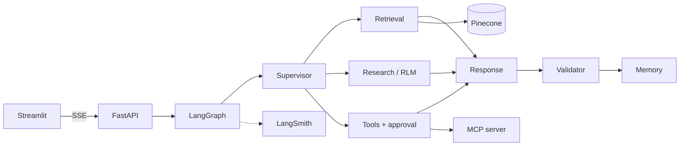

# Crestline Assistant

An internal AI assistant for **Crestline Commercial Bank** (a fictional bank). Employees can ask
about policies, architecture, runbooks, incidents, product specs and meeting notes. The assistant
searches the documents, calls enterprise tools, explains its reasoning with citations, and remembers
the conversation. Every step the agents take is visible live in the UI and traced in LangSmith.

**Stack:**
- **Agents:** LangGraph multi-agent graph.
- **Models:** Gemini 3.8 Flash for chat, Gemini embeddings.
- **Search:** Pinecone hybrid search (dense + BM25) with reranking.
- **Services:** FastAPI (async, SSE streaming), Streamlit UI, MCP server for enterprise data.
- **Tracing:** LangSmith.
- **Deployment:** Docker Compose.

- Architecture and design decisions: [docs/architecture.md](docs/architecture.md)
- Demo walkthrough: [docs/demo-script.md](docs/demo-script.md)



## Quick start

### With Docker

```bash
cp .env.example .env            # add keys (all optional, see below)
docker compose up --build
```

- UI: http://localhost:8501
- API: http://localhost:8000/docs (health at `/health`)
- MCP server: http://localhost:8001/mcp

**Demo users:**

| User | Password | Role |
|---|---|---|
| `viewer1` | `viewer123` | Viewer: chat and search only |
| `analyst1` | `analyst123` | Analyst: adds deep research, analytics and MCP tools |
| `admin1` | `admin123` | Administrator: all tools, write actions with approval, fault switches, audit log |

### Locally with uv

```bash
uv sync
uv run python -m mcp_server.server                 # terminal 1, port 8001
uv run uvicorn app.main:app --port 8000            # terminal 2
uv run streamlit run ui/app.py                     # terminal 3, port 8501
```

### Loading the knowledge base into Pinecone

```bash
uv run python -m app.retrieval.ingest              # creates the hybrid index and upserts 166 chunks
uv run python -m app.retrieval.ingest --recreate   # rebuild from scratch
```

The ingest command ends with a smoke query through the same search code the agents use.

## Keys and running without them

| Variable | Needed for | Without it |
|---|---|---|
| `GOOGLE_API_KEY` | Gemini chat and embeddings | Keyword planner, fixed research plan, extractive answers ("limited mode") |
| `PINECONE_API_KEY` | Hybrid vector search and reranker | Local BM25 over the same chunks |
| `LANGSMITH_API_KEY` | Traces and feedback | Tracing off; the UI activity panel still works |

Every path above is the same code the app uses when a dependency fails in production. That is why
the whole test suite runs offline.

> **Gemini free tier.** Each Flash model allows about 20 requests per day on a free key, and one deep
> research turn uses around 10. For demos, enable billing on the key, or set
> `GEMINI_MODEL=gemini-3.5-flash-lite` in `.env`.

## How the brief maps to the code

| Requirement | Where |
|---|---|
| Chat, streaming, agent activity panel | `ui/app.py`, SSE in `app/main.py` |
| Async FastAPI, structured logging, error handling | `app/main.py`, `app/observability.py`, node wrapper in `app/agents/graph.py` |
| Supervisor, retrieval, research, response agents | `app/agents/*.py` |
| Recursive Language Model | `app/agents/research_agent.py`, `app/sandbox.py` |
| Hybrid search, namespaces, metadata filters, attribution, reranking | `app/retrieval/search.py`, `app/retrieval/bm25.py`, `app/retrieval/documents.py` |
| Conversational and long-term memory | `app/memory.py`, `app/agents/memory_agent.py` |
| Knowledge search, MCP and Python analysis tools | `app/tools.py`, `mcp_server/server.py` |
| LangSmith tracing and feedback | config in `app/main.py`, `@traceable` in search and research, `app/observability.py` |
| Prompt injection protection, validation, guardrails | `app/guardrails.py`, `app/agents/guard.py`, validator in `app/agents/response_agent.py` |
| Auth and RBAC (hardcoded users) | `app/auth.py` (`ROLE_POLICY`), enforced in `app/tools.py` and `app/retrieval/search.py` |
| Token bucket rate limiting | `app/auth.py` (`TokenBucket`) |
| Graceful degradation | `app/resilience.py` (circuit breakers, fault switches) |
| Human-in-the-loop approval | `approve_action` in `app/agents/tool_agent.py` |
| Feedback loop | thumbs up/down in UI → `/feedback` → LangSmith and store |
| Mock data | `data/docs/` (28 documents), `data/mcp/` (employees, services, incidents) |
| Docker Compose | `Dockerfile`, `docker-compose.yml` |

## Tests and evaluation

```bash
uv run pytest             # 49 tests, no keys or network needed
uv run ruff check .
uv run python -m evals.run
```

The tests cover:
- guardrails (injection, redaction, citations, canary, brand rules)
- auth and the token bucket
- the circuit breaker
- BM25 and access filters
- the sandbox escape attempts
- RBAC at tool execution
- full graph runs, including memory across turns, viewer limits, research batching, and the
  approval pause and resume
- API behaviour (401, 403, 422, 429, SSE)

Retrieval eval (`evals/golden.yaml`, 15 paraphrased questions):

| System | recall@5 | MRR |
|---|---|---|
| BM25 (offline) | 1.00 | 0.85 |
| Hybrid / hybrid + rerank | run `python -m evals.run` with keys | |

## Project layout

```
app/
  main.py              API endpoints and SSE streaming
  config.py            settings from .env
  auth.py              users, roles, JWT, token bucket
  guardrails.py        input/output safety checks
  sandbox.py           restricted Python runner
  resilience.py        circuit breakers and fault switches
  llm.py               Gemini models with fallback, embeddings
  memory.py            session and long-term memory, audit, feedback
  tools.py             tool registry, MCP client, execute_tool()
  retrieval/           documents, bm25, search, ingest
  agents/              state, graph, guard, memory, supervisor, retrieval, research, tool, response agents
mcp_server/server.py   enterprise data MCP server
ui/app.py              Streamlit UI
data/                  mock documents and MCP datasets
evals/                 retrieval golden set and runner
tests/                 offline test suite
docs/                  architecture and demo script
```

## Assumptions

- **Documents.** The document store is the markdown folder. In production these would come from
  SharePoint or Confluence through the same loader interface. Ingestion is a CLI, not a pipeline.
- **Authentication.** Option A from the brief: hardcoded users with salted PBKDF2 hashes and JWTs.
  Keycloak or Azure AD would replace `authenticate()` and `current_user()` only.
- **Access levels.**
  - Roles map to data classifications: viewers see public and internal, analysts add confidential,
    admins add restricted.
  - Department is used for filtering, not for access control.
- **Approval.** "Human in the loop" means the requesting admin confirms the write action. A separate
  approver queue would reuse the same interrupt.
- **Dates.** "Last year" means the 365 days before today.
- **The bank.** The bank, people and incidents are fictional. Emails use the reserved
  `crestline.example` domain.

## Trade-offs

- **One planning call, deterministic routing.** It is cheaper, faster and easier to explain than a
  supervisor LLM loop, but it is less adaptive mid-run. The corrective retrieval retry and the
  research loop add adaptivity where it matters.
- **Our own BM25 for sparse vectors.** About 90 lines, fully explainable, and it doubles as the offline
  fallback and the memory ranker. A learned sparse model (for example `pinecone-sparse-english-v0`)
  might retrieve better.
- **Deterministic guardrails over an LLM judge.** They are fast, cheap, testable, and cannot be
  prompt-injected. They can miss novel phrasings, so they are layered with prompt-level rules and data
  delimiters. An LLM groundedness judge would be the next addition.
- **Research searches locally.** The research agent explores an in-memory copy of the chunks, already
  filtered by role, so the generated code can call search synchronously and cheaply. The retrieval
  agent uses Pinecone. At much larger scale the research helpers would call the vector DB too.
- **Sandbox.** The Python sandbox checks the code's syntax tree and enforces a deadline. It is not an
  operating-system sandbox; production would isolate it in a container.
- **Single process state.** In-memory rate limits, circuit breakers and fault switches, and SQLite for
  checkpoints and memory. The upgrade path is Redis for the first three and Postgres
  (`AsyncPostgresSaver` / `AsyncPostgresStore`) for the last two.
- **Streaming and validation.** Tokens stream before validation finishes. Streamed text passes the
  redaction and link filters line by line, and the final validated answer replaces the draft. If the
  validator rejects a draft, the UI clears it and shows the regenerated one.
- **Library pinning.** `mcp` is pinned to 1.x because `langchain-mcp-adapters` 0.3 does not support
  mcp 2.x yet.
