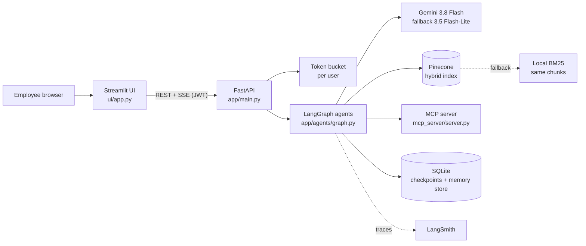
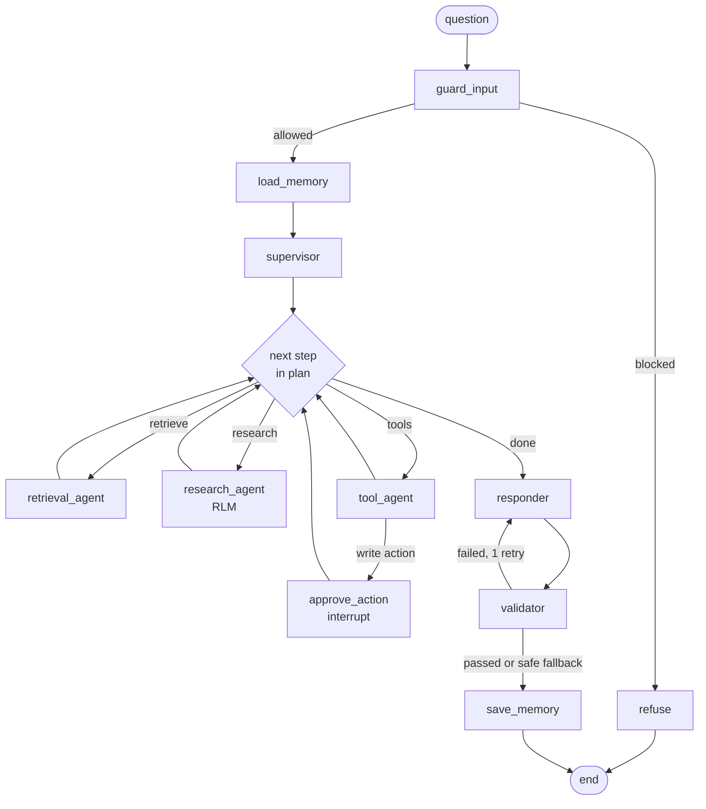

# Architecture

This document explains how the assistant is built and why. The code is referenced by path so each
decision can be checked against the implementation.

## 1. System overview



| Process | Port | Role |
|---|---|---|
| `ui` | 8501 | Chat and live agent activity panel. No business logic. |
| `api` | 8000 | Auth, rate limiting, runs the graph, streams events. |
| `mcp` | 8001 | Dummy enterprise systems (directory, service catalog, incidents). |

The MCP server is a separate process on purpose: it can fail on its own, which is how we demonstrate
the MCP failure path.

## 2. The agent graph



| Agent | File | Job |
|---|---|---|
| Input guard | `app/agents/guard.py` | Validates the message and scores prompt-injection risk. Resets per-turn state. |
| Memory loader | `app/agents/memory_agent.py` | Loads session summary, user facts and related past questions. |
| Supervisor | `app/agents/supervisor.py` | Intent, standalone question, sub-tasks, ordered steps, search scope. Applies role limits. |
| Retrieval agent | `app/agents/retrieval_agent.py` | Hybrid search with filters, reranking, one corrective retry. |
| Research agent | `app/agents/research_agent.py` | Recursive Language Model loop for multi-document questions. |
| Tool agent | `app/agents/tool_agent.py` | LLM tool calling with role-filtered tools; read calls run concurrently. |
| Approval node | `app/agents/tool_agent.py` | Pauses the graph with `interrupt()` before any write tool. |
| Response agent | `app/agents/response_agent.py` | Writes the answer with citations; streamed to the UI. |
| Validator | `app/agents/response_agent.py` | Deterministic output checks, one retry, then a safe fallback. |
| Memory saver | `app/agents/memory_agent.py` | Saves the turn, folds old turns into a summary, stores long-term memory. |

### Why a planned supervisor instead of a supervisor loop

The supervisor makes **one** structured call that returns the full plan (for example
`["retrieve", "tools"]`). A plain function (`next_step` in `graph.py`) routes through it. A classic
supervisor loop calls the LLM again after every worker. That costs more, is slower, and is harder to
explain when something goes wrong. The plan is visible in the activity panel and in LangSmith, so
the routing is easy to follow.

We also considered running workers in parallel with LangGraph `Send`. We did not, because the steps
often depend on each other (search first, then look up the owner of the service that was found) and
because parallel branches complicate the approval pause. Concurrency happens inside the agents
instead: namespaces are searched in parallel, read-only tools run in parallel, and research sub-calls
are batched.

### How agents share state, and how failures are contained

`app/agents/state.py` defines the shared state.

- **Each agent owns a slice.** The supervisor writes `plan`, retrieval adds to `evidence`, tools add to
  `tool_results`. Agents never edit each other's slices, so the order they run in cannot corrupt data.
- **Reducers for shared lists.** `evidence` is merged and de-duplicated by chunk id, and `errors` and
  `notes` are appended, so two agents can contribute without overwriting each other.
- **Identity is not in state.** The user is LangGraph *runtime context* (`context_schema=User`).
  Nodes can read it but never change it, and it is never shown to the LLM as editable data.
- **Per-turn reset.** The input guard overwrites the per-turn fields with `Overwrite([])`, so evidence
  or errors from the last question never leak into the next one.

Every node is wrapped by `node()` in `graph.py`. This is the main defence against one failure
spreading through the whole run (the "butterfly effect"):

| Concern | What the wrapper does |
|---|---|
| Visibility | Emits `start` / `end` / `error` events with timings to the activity panel. |
| Hangs | Enforces a per-node timeout with `asyncio.timeout`. |
| Crashes | Catches the exception and records it in `state["errors"]` with the node name. It then applies a node-specific fallback: an extractive draft if the responder fails, a safe message if the validator fails. |
| Routing loops | Worker nodes advance the plan even when they fail, so the router cannot send the run back to a broken agent forever. |
| Human approval | Re-raises `GraphBubbleUp`, so LangGraph's `interrupt()` still pauses the run. |

Downstream agents read `errors` and `notes` and degrade on purpose. For example, the responder
mentions that a system was unavailable instead of pretending it had the data.

## 3. Retrieval (RAG)

**Corpus.** 28 markdown documents with YAML front matter (`doc_id`, `title`, `document_type`,
`department`, `access_level`, `created_date`, `owner`, `tags`). `app/retrieval/documents.py` splits
each document on `##` headings, so a chunk is one section ("Root Cause", "Rollback"). That makes
citations meaningful (`INC-2025-041#4`) and lets the research agent read a single section.

**Namespaces.** Documents are grouped by domain, and the supervisor searches only the namespaces a
question needs:

| Namespace | Document types |
|---|---|
| `engineering` | architecture, runbook, incident |
| `governance` | policy |
| `product` | product_spec, meeting_notes |

**Hybrid search** (`app/retrieval/search.py`):

1. **Dense.** Gemini `gemini-embedding-001` at 768 dimensions, L2-normalised so a dot product equals
   cosine similarity.
2. **Sparse.** Our own BM25 (`app/retrieval/bm25.py`). Tokens are hashed with crc32 into Pinecone
   sparse indices, and query weights are IDF values normalised to sum to 1. The same BM25 object
   supplies the IDF at ingest and at query time, so the two always agree.
3. **Combined score.** Both vectors go in one Pinecone query. The dense vector is scaled by `alpha`
   and the sparse vector by `1 - alpha` (`HYBRID_ALPHA`, default 0.6), so Pinecone's dot product is
   `alpha * dense + (1 - alpha) * sparse`. We also recompute both parts per hit, and the activity
   panel shows dense, sparse, hybrid and rerank scores side by side.
4. **Namespaces in parallel.** Each selected namespace is queried concurrently with `asyncio.gather`.
5. **Reranking.** The merged candidates (3 × top_k) go through Pinecone's hosted `bge-reranker-v2-m3`.
6. **Corrective retry.** If nothing is found, or the best rerank score is below `MIN_RERANK_SCORE`,
   the retrieval agent asks the LLM to rewrite the query and searches all namespaces without filters.

**Metadata filters.** The server adds `access_level $in allowed(role)` to every query. The supervisor
can narrow by `document_type`, `department` and `created_ts >= since`; dates are stored as numbers
because Pinecone range filters need numbers.

**Attribution.** Every hit carries `doc_id`, `title`, `section` and `created_date`. The answer cites
chunk ids, and the validator checks each one against the retrieved set.

**Fallback.** When Pinecone is unconfigured, down, or its circuit breaker is open, the same filters
run over the local chunks with BM25. The result is labelled `keyword_fallback`, and the answer
mentions it.

**Pinecone 10 note.** A hybrid index must declare its sparse field when it is created. We create it
with the reserved field names used by the vectors API (`_values`, `_sparse_values`), so the familiar
`upsert(values, sparse_values)` / `query(vector, sparse_vector)` calls work (`app/retrieval/ingest.py`).

**Evaluation.** `evals/golden.yaml` has 15 questions deliberately phrased differently from the
documents. `python -m evals.run` reports recall@5 and MRR for BM25, hybrid, and hybrid + rerank
(the last two need keys).

## 4. Recursive Language Model (research agent)

Loading every incident report into a prompt does not scale, and it buries the useful sections. The
research agent follows the RLM idea instead: the model explores the collection through code and sees
only what it prints.

```mermaid
sequenceDiagram
    participant Root as Root LM (depth 0)
    participant Py as Sandbox (Python)
    participant Sub as Sub-LM calls
    participant Child as sub_agent (depth 1)
    Root->>Py: docs = find_documents(document_type="incident", since="2025-09-26", query="payment")
    Py-->>Root: 7 documents (catalog only)
    Root->>Py: batches = batch(docs, 3); texts = [read_section(d, "Root Cause") ...]
    Root->>Py: findings = llm_batch([f"Extract cause, impact, date: {t}" for t in texts])
    Py->>Sub: 3 prompts in parallel
    Sub-->>Py: per-batch findings with [chunk ids]
    Root->>Py: detail = sub_agent("Compare NorthGate timeout incidents", ["INC-2025-052", "INC-2026-021"])
    Py->>Child: new research loop over 2 documents
    Child-->>Py: FINAL(comparison)
    Root->>Py: FINAL(aggregated summary with recurring root causes)
```

| Step from the brief | How it is done |
|---|---|
| Explore collections | The root model starts with a catalog: titles, types, dates and section names, but no content. |
| Python search plans | Each turn the model writes one Python cell using `find_documents`, `search`, `read_section` and `batch`. |
| Decompose large tasks | `batch()` splits the work, and `llm_batch()` analyses the batches in parallel (max concurrency 4). |
| Retrieve targeted sections | `read_section(doc_id, "Root Cause")` returns one section, sanitised and prefixed with its citation id. |
| Call sub-agents recursively | `sub_agent(task, doc_ids)` starts a new research loop on a subset of documents (maximum depth 2). |
| Aggregate | The model combines the batch results in code and calls `FINAL(answer)`. |

**Limits.**
- 6 cells per loop and 20 sub-calls per task.
- 170-second deadline.
- Output shown back to the model is truncated to 2,000 characters.

**Fallback.** If the generated code fails twice, or the model never calls `FINAL`, a fixed plan runs:
find → batch → analyse each batch → combine. It also runs when no LLM is available at all, in which
case the analysis is extractive.

**Citations.** Every section the code reads is recorded and becomes evidence, so the validator's
citation check also applies to research answers.

**Access control.** The collection the code can see is filtered to the user's access levels *before*
the sandbox starts. The generated code has no way to reach restricted documents.

**Sandbox** (`app/sandbox.py`):
- An AST allowlist blocks imports, `with` / `try` / `class`, dunder and private attributes, and `str.format`.
- The builtins are minimal.
- A `sys.settrace` deadline stops infinite loops.
- The same sandbox runs the `python_analysis` tool.

This is defence in depth, not operating-system isolation. Production would run the code in a
separate container or microVM.

## 5. Memory

| Layer | Storage | What it holds | Why |
|---|---|---|---|
| Session | LangGraph `AsyncSqliteSaver`, thread `user:session` | Full graph state including messages | Survives turns and API restarts. Also required for the approval pause and resume. |
| Long conversations | same | Last 6 turns verbatim plus a rolling LLM summary of older turns | Keeps prompts small without forgetting earlier context. |
| User context | Runtime context and store `(user, "facts")` | Name, role and department, plus facts the user states ("I work on the payments team") | Personalised, role-aware answers. |
| Relevant history | Store `(user, "interactions")` | Every question with an answer summary and citations | "Last time you asked about..." across sessions. |

Relevant past interactions are ranked with BM25 over the user's last 50 questions. At this size that
is instant and needs no extra embedding calls. The upgrade path is a vector index on the LangGraph
store.

Facts are extracted with a few regex patterns, which is cheap and predictable. An LLM extractor would
catch more phrasings at the cost of one extra call per turn.

The same store also holds the audit log and answer feedback, so there is one persistence mechanism
to operate.

## 6. Tools and RBAC

`ROLE_POLICY` in `app/auth.py` is the single source of truth:

| Role | Document access | Tools |
|---|---|---|
| viewer | public, internal | knowledge_search |
| analyst | + confidential | + deep_research, python_analysis, search_employees, get_service, search_incidents |
| admin | + restricted | + create_incident (write, needs approval), view_audit_log |

Tool access is enforced in four places, so a tricked LLM still cannot bypass it:

1. **The LLM only sees permitted tools.** `tools_for(user)` builds the list bound to the model.
2. **Every call is checked again.** `execute_tool()` in `app/tools.py` re-checks the role on each call,
   using the role from the verified token, never from LLM output. Denials are audited and shown in the panel.
3. **Retrieval filters by access level.** The retrieval filter and the research sandbox's collection
   are both restricted by `access_level`.
4. **Write tools pause for a human.** They go through the approval node, which checks the role again
   before running.

**Other tool safeguards.**
- **Arguments.** Local tools validate with Pydantic. For MCP tools, unknown or missing arguments and
  oversized strings are rejected before the call, and FastMCP validates again on the server.
- **Limits.** Each tool call has a timeout, and there are at most 6 tool calls per turn.

## 7. Security and guardrails

All checks live in `app/guardrails.py` and are deterministic, so they cannot themselves be prompt-injected.

| Threat | Protection |
|---|---|
| Instruction override, role hijack | Weighted regex signals on user input. A score of 0.6 or more is refused; 0.3 or more is flagged and audited. |
| Indirect injection in documents | Retrieved chunks are scanned sentence by sentence and suspicious sentences removed (`MTG-2026-011` contains a planted one). Evidence goes to the model inside `<document>` tags, and closing tags in the text are neutralised. |
| System prompt leakage | A random canary string sits in the system prompt. If it appears in output, the check fails and it is removed. |
| Data exfiltration | Markdown images and links to non-bank domains are stripped from answers, including while tokens stream. Card numbers (Luhn-checked), NIC numbers and API keys are redacted. |
| Tool abuse | Role checks at execution, argument validation, per-turn call limit, timeouts, human approval for writes, sandboxed Python. |
| Unauthorised access | JWT on every endpoint. The role is looked up server-side. Access-level filters are applied in the vector DB query. |
| Hallucinated citations | Citations not in the retrieved set are removed and the answer is retried once. A knowledge answer with no citations is also retried. |
| Invalid responses | Empty or overlong answers are retried, then replaced by a safe extractive answer. |
| Brand value | The system prompt sets Crestline's voice. The output check blocks financial guarantees, investment advice, disparaging competitors and unprofessional language. Refusals use a consistent, polite template. |

Input validation happens at every boundary:
- **API requests:** Pydantic (message length, session id pattern, feedback score range).
- **User text:** control characters stripped, length checked.
- **Tool parameters:** Pydantic and schema checks.
- **Retrieved content:** size cap and injection scan.

## 8. Reliability

| Failure | Detection | Degraded behaviour |
|---|---|---|
| LLM (primary) | API error | `with_fallbacks` switches to Flash-Lite. |
| LLM (all) | No key, or all models fail | Keyword planner, fixed research plan, extractive answer marked "limited mode". |
| Pinecone | Error or timeout; breaker opens after 3 failures | Local BM25 over the same chunks; the reranker is skipped. |
| MCP server | Connection error; breaker | Tools reported unavailable; the answer continues without them. |
| Tool timeout | `asyncio.wait_for` | Error shown in the panel; other results are still used. |
| Invalid request | Pydantic / guard | 401, 403, 422 or 429 with a clear message; refusal in chat. |
| Agent crash | Node wrapper | Error recorded, node fallback applied, run continues. |

Retries happen inside the clients (Gemini `max_retries`, Pinecone's built-in retry), so we did not add
a second retry layer. The circuit breaker (`app/resilience.py`) stops us from hammering a dependency
that is clearly down.

Admins can flip **fault switches** in the UI (`llm_primary`, `llm_all`, `pinecone`, `mcp`,
`tool_timeout`) to show each path live.

**Rate limiting.** A token bucket per user, with capacity and refill rate per role set by
`RATE_LIMITS`. When the bucket is empty the API returns 429 with `Retry-After`, and the UI shows a
friendly message. Buckets are in memory, which is correct for one API process; several replicas
would need Redis.

## 9. Observability

- **LangSmith.** Set `LANGSMITH_TRACING=true` and `LANGSMITH_API_KEY`. Each chat turn is one trace
  named `chat_turn`, with `run_id` generated by the API.
  - **Thread grouping.** Traces carry `thread_id` / `session_id` metadata, so LangSmith groups them
    into threads.
  - **Child runs.** Every graph node, LLM call and tool call is a child run. So are the retrieval
    (`hybrid_search`, run type retriever) and each RLM step (`rlm_research`, `rlm_cell`,
    `rlm_fixed_plan`, `rlm_sub_query`).
  - **Tags and metadata.** Traces are tagged with the user's role, and metadata includes the user.
  - **Linking from the UI.** The UI shows the run id under every answer, and thumbs up/down feedback
    is attached to that trace (`create_feedback`).
- **Activity stream.** The same events that drive the UI panel are available to any SSE client.
- **Structured logs.** JSON logs via structlog, with `request_id`, `user`, `session`, `run_id` and `path`
  bound per request.
- **Audit log.** Tool calls, denials, blocked or flagged inputs, approvals and fault changes are
  stored in the audit log and visible to admins.

## 10. Model selection

| Use | Model | Reason |
|---|---|---|
| All agents | `gemini-3.8-flash` | Current stable Flash model. Fast and inexpensive, with reliable tool calling and JSON-schema output and a 1M-token context. Answers are grounded in retrieved text, so a Pro model would add latency and cost for little gain. |
| Fallback | `gemini-3.5-flash-lite` | Different model, same API, very cheap. Keeps the assistant answering when the primary fails. |
| Embeddings | `gemini-embedding-001` @ 768 | Strong retrieval quality. 768 dimensions cut storage and latency to a quarter of the full 3072 with little quality loss. |
| Reranker | Pinecone `bge-reranker-v2-m3` | Hosted cross-encoder, no extra service to run. Skipped automatically if it is unavailable. |

All model names are environment variables.

**Routing by cost.** High-volume, low-stakes calls try the lite model first and fall back to the main
model: research sub-queries (`llm_query` / `llm_batch`), query rewrites and memory summaries. That is
`llm(..., light=True)` in `app/llm.py`. Planning, tool use, the research root loop and final answers
use the main model first.

**Thinking level.** `GEMINI_THINKING_LEVEL=low` keeps a multi-step turn responsive. Answers are grounded
in retrieved text, so deeper reasoning adds latency for little gain. It can be raised per deployment.

**Built for the Gemini free tier.** Free keys have small quotas that apply per model: about 20 requests
per day on a Flash model and 100 embedded texts per minute. The assistant is designed around that:

| Measure | Where |
|---|---|
| A chain of six free models (four Flash, two Flash-Lite). Each has its own quota, so the chain multiplies the daily allowance. | `GEMINI_MODEL`, `GEMINI_FALLBACK_MODEL` |
| A quota tracker reads real 429 responses. A model whose daily quota is used up is skipped until the midnight Pacific reset; a per-minute limit skips it for the retry delay Google sends. Calls go straight to the next model instead of waiting on errors. | `record_quota_error`, `QuotaWatcher` in `app/llm.py` |
| A client-side limiter keeps each model under `GEMINI_RPM` requests per minute, so bursts (parallel research sub-queries) do not trigger 429s. | `InMemoryRateLimiter` in `app/llm.py` |
| Cheap calls go to Flash-Lite first. | `llm(..., light=True)` |
| Research budget: 6 turns, 12 sub-calls, 2 in parallel. | `app/agents/research_agent.py` |
| Ingestion embeds 20 texts at a time and waits out the per-minute limit when it is hit. | `app/retrieval/ingest.py` |
| When every model is used up, the no-LLM path takes over: keyword planner, fixed research plan, extractive answers with citations. | `llm_available()` |

`/health` and the UI's System health panel list which models are usable and which are waiting for
their quota to reset.
